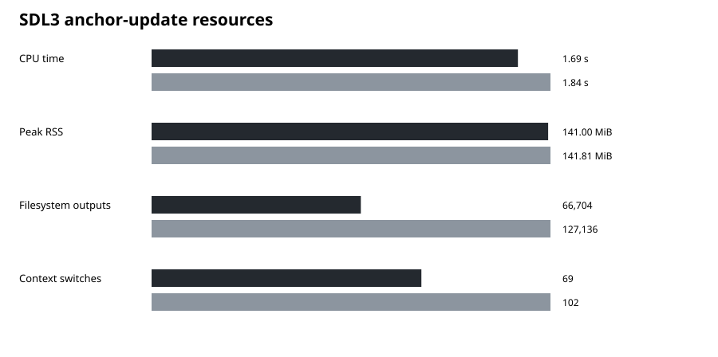

# SDL3 benchmark

_Generated automatically by the manually-triggered SDL3 benchmark GitHub Actions workflow. Do not edit benchmark numbers by hand._

## Scaling curve

The x-axis is the **actual measured number of translation units rebuilt**. For extra history points, the benchmark keeps one fixed 219-TU endpoint tree/build graph and replaces only files that were genuinely modified in an older real SDL range with their historical contents. Additions and deletions stay at the endpoint so the source set remains comparable.

| Rebuilt TUs | SDL range | `c` | CMake + Ninja | Result |
| ---: | --- | ---: | ---: | --- |
| 0 | No changes | 10.5 ms | 14.7 ms | `c` 28.4% faster |
| 4 | 7 commits / 9 files | 946.9 ms | 1.10 s | `c` 13.5% faster |
| 6 | 9 commits / 24 applied files | 1.26 s | 1.41 s | `c` 10.7% faster |
| 219 | Clean build | 35.21 s | 35.98 s | `c` 2.1% faster |

Each extra history point is measured 3 times. Candidate ranges are selected from Ninja's real endpoint dependency graph. Points that do not build cleanly or rebuild different TU counts between the tools are skipped instead of invalidating the whole report.

`c` vs CMake + Ninja on a real SDL3 static debug build. Lower is better.

## Core measurements

| Build | `c` | CMake + Ninja |
| --- | ---: | ---: |
| Clean build | 35.21 s | 35.98 s |
| No changes | 10.5 ms | 14.7 ms |
| Real 7-commit anchor update | 946.9 ms | 1.10 s |
| Archive only | 123.8 ms | 233.6 ms |
| Anchor TUs rebuilt | 4 / 219 | 4 / 219 |

## Anchor update resources

| Metric | `c` | CMake + Ninja |
| --- | ---: | ---: |
| CPU time | 1.69 s | 1.84 s |
| Peak RSS | 141.00 MiB | 141.81 MiB |
| Filesystem outputs | 66,704 | 127,136 |
| Context switches | 69 | 102 |

## Setup cost

| Metric | Fresh `c` build-script cache | CMake configure |
| --- | ---: | ---: |
| Wall time | 201.8 ms | 12.63 s |
| Peak RSS | 36.13 MiB | 136.93 MiB |

## Runner

- **Date:** 2026-08-14
- **CPU:** Intel(R) Xeon(R) Platinum 8370C CPU @ 2.80GHz (4 vCPUs)
- **Jobs:** 2
- **Compiler:** cc (Ubuntu 13.3.0-6ubuntu2~24.04.1) 13.3.0
- **CMake:** cmake version 3.31.6
- **Ninja:** 1.13.2
- **SDL endpoint:** `eba3c7ae0ad8`
- **Object cache:** disabled
- **PCH:** disabled

## Method

- Clean build: median of 3 runs.
- No changes: median of 10 runs.
- Anchor update: median of 5 runs.
- Both systems use the same SDL static-target source set and semantic compile flags.
- SDL revision metadata is pinned to `benchmark`.
- Hosted-runner measurements describe this run, not every machine.

The downloadable **`sdl3-benchmark-31`** artifact contains the raw log, JSON measurements and SVG charts.

Raw measurements and every sample: [`benchmarks/sdl3/results.json`](benchmarks/sdl3/results.json)
