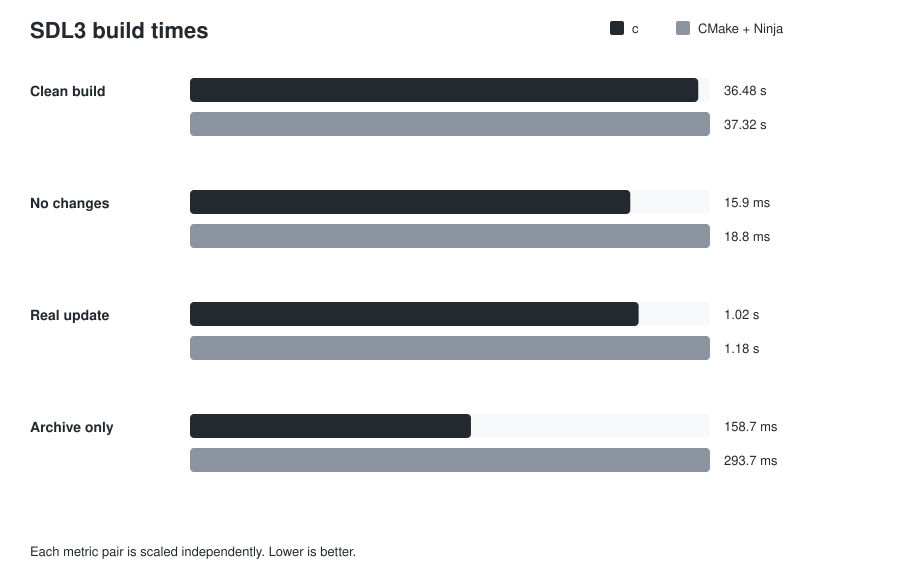

# c

Build C with C.

```c
#include <cbuild.h>

void build(C_Build *b) {
  C_Target *app = c_executable(b, "app");
  c_sources(app, "src/*.c");
}
```

- `build.c` is normal C.
- Git dependencies.
- Incremental builds.
- Parallel compilation.
- Global object cache.
- Lockfiles.
- `compile_commands.json`.
- macOS + Linux.

## Why

- I got tired of build config becoming another language.
- I wanted one small tool.
- One command to build.
- One command to run.
- I use it on my own projects.
- If something annoys me there, I usually end up fixing it here.

## Real use

- [BGE](https://github.com/xt9y/BGE) builds with `c`.
- There is also a small raylib example in `examples/raylib`.

## Install

```bash
git clone https://github.com/xt9y/C.git
cd C
make
sudo make install
```

Then:

```bash
c build
c run
```

Docs (Thanks to AI): https://xt9y.de/c.html

## SDL3 benchmark

Real SDL3 static debug build, 219 translation units, 2 build jobs on a 4-vCPU GitHub Actions runner.



- Clean: **38.22 s** with `c`, 39.26 s with CMake + Ninja.
- Real 7-commit update: **1.10 s** with `c`, 1.29 s with CMake + Ninja.
- Both rebuild the same **4 / 219** translation units.

The clean builds are close. The real update is the more useful comparison because both systems do the same incremental compile work.

Full results, resource usage, stability, setup cost, methodology and raw samples: [BENCHMARK.md](BENCHMARK.md)

## Notes

- This is a young project.
- I am still changing things.
- Issues and weird edge cases are useful.

## License

MIT
